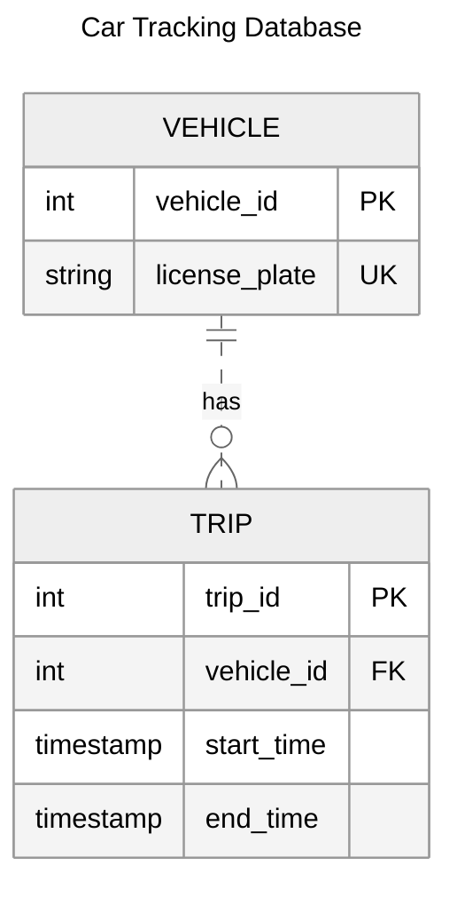

# Database Diagrams

## Table Diagram

```mermaid
---
title: Car Tracking Database
config:
  theme: neutral
---
erDiagram
    direction TB

    VEHICLE ||..o{ TRIP : has

    VEHICLE {
        int vehicle_id PK
        string license_plate UK
    }

    TRIP {
        int trip_id PK
        int vehicle_id FK
        timestamp start_time
        timestamp end_time
    }
```